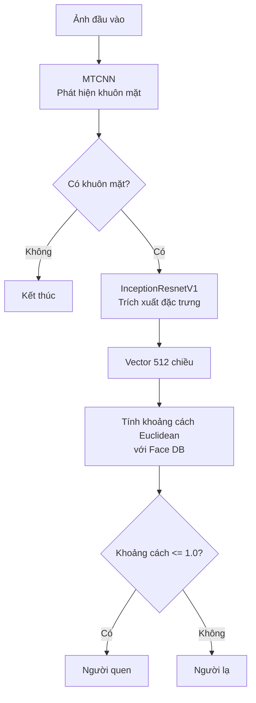
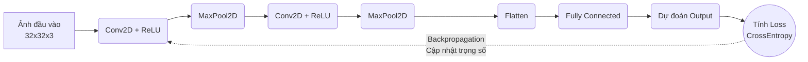
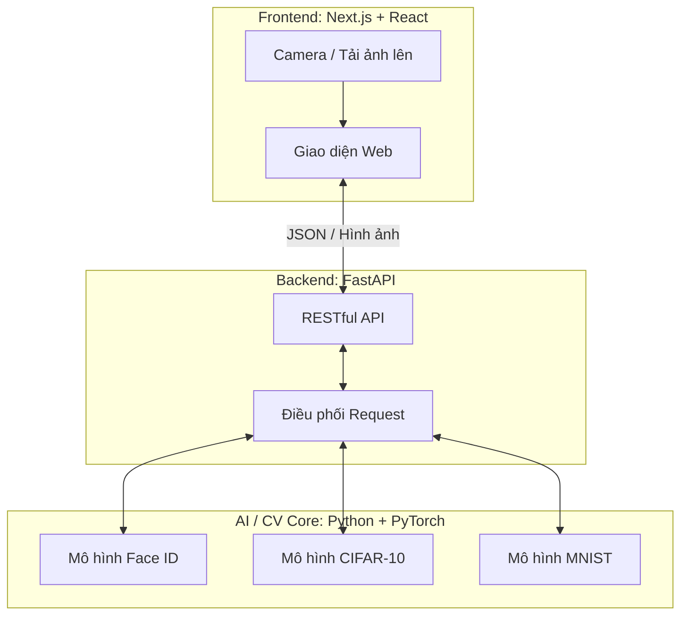

<div align="center">
  <h1>CNN</h1>

  <div>
    
    
    
    
    
    
  </div>
</div>

<br />

##  Giới thiệu dự án

Dự án **Hệ thống Trí tuệ Nhân tạo Nhận diện và Phân tích Hình học 2D** là một hệ sinh thái toàn diện kết hợp giữa các mô hình Deep Learning tiên tiến (CNN) và kiến trúc Web hiện đại. 

Trong kho lưu trữ này chứa các thành phần cốt lõi về **Trí tuệ Nhân tạo (AI)**, bao gồm các mô hình nhận diện khuôn mặt, phân loại đối tượng (CIFAR-10) và nhận diện chữ số viết tay (MNIST). Các mô hình này được xây dựng trên nền tảng PyTorch và cung cấp giao diện trực quan thông qua Tkinter trước khi được tích hợp vào hệ thống API backend (FastAPI).

---

##  Các tính năng AI cốt lõi

### 1. Nhận diện khuôn mặt (Face ID)
*   **File chính:** `faceid.py`
*   **Mô tả:** Sử dụng mạng MTCNN để phát hiện khuôn mặt và InceptionResnetV1 (pretrained trên `vggface2`) để trích xuất vector đặc trưng 512 chiều.
*   **Khả năng:**
    *   Tự động trích xuất và xây dựng cơ sở dữ liệu khuôn mặt từ thư mục ảnh cục bộ.
    *   Nhận diện khuôn mặt với độ chính xác cao bằng cách tính khoảng cách Euclidean giữa các vector đặc trưng (ngưỡng xác định người lạ/người quen).

**Sơ đồ luồng xử lý Face ID:**


### 2. Phân loại hình ảnh đa đối tượng (CIFAR-10)
*   **File chính:** `cifar10.py` (Huấn luyện) & `nhandien_cifar10.py` (Giao diện)
*   **Mô tả:** Xây dựng mạng CNN tùy chỉnh (Convolutional Neural Network) để phân loại hình ảnh vào 10 lớp khác nhau (Máy bay, Ô tô, Chim, Mèo, Hươu, Chó, Ếch, Ngựa, Tàu thủy, Xe tải).
*   **Khả năng:**
    *   Huấn luyện mô hình từ đầu với tập dữ liệu CIFAR-10.
    *   Tải ảnh bất kỳ qua giao diện để mô hình đưa ra dự đoán về đối tượng trong ảnh.

**Mô phỏng Quá trình Huấn luyện CNN (Learning Process):**


### 3. Nhận diện chữ số viết tay (MNIST)
*   **File chính:** `tichchap.py` (Huấn luyện) & `nhandien.py` (Giao diện)
*   **Mô tả:** Triển khai mô hình tích chập (CNN) cơ bản để nhận diện chính xác các chữ số từ 0-9.
*   **Khả năng:**
    *   Cung cấp bảng vẽ trực tiếp để người dùng viết tay chữ số.
    *   Hỗ trợ tải lên hình ảnh chữ số có sẵn. Tự động tiền xử lý (cắt nét, chuẩn hóa, định cỡ 28x28) để tối ưu hóa dự đoán.

---

##  Cài đặt và cấu hình

### 1. Yêu cầu hệ thống
*   Python 3.11+
*   Nên sử dụng môi trường ảo (Virtual Environment) như `venv` hoặc `conda`.

### 2. Cài đặt các thư viện cần thiết
Mở terminal và chạy các lệnh sau:

```bash
# Cài đặt PyTorch và TorchVision (Tùy thuộc vào việc máy bạn có hỗ trợ CUDA hay không)
pip install torch torchvision

# Cài đặt các thư viện xử lý ảnh và giao diện
pip install Pillow
pip install opencv-python

# Cài đặt thư viện chuyên dụng cho FaceID
pip install facenet-pytorch
```

---

##  Hướng dẫn sử dụng

### Chạy hệ thống Nhận diện chữ số (MNIST)
1. Huấn luyện mô hình: `python tichchap.py` (Tạo ra file `mnist_cnn_model.pth`).
2. Mở giao diện nhận diện: `python nhandien.py`.
3. Bạn có thể dùng chuột vẽ số trực tiếp trên màn hình hoặc tải ảnh số viết tay lên.

### Chạy hệ thống Phân loại đối tượng (CIFAR-10)
1. Huấn luyện mô hình: `python cifar10.py` (Tạo ra file `cifar10_cnn_model.pth`).
2. Mở giao diện nhận diện: `python nhandien_cifar10.py`.
3. Tải lên một hình ảnh bất kỳ để mô hình phân tích xem đó là đối tượng gì.

### Chạy hệ thống Face ID
1. Khởi chạy ứng dụng: `python faceid.py`.
2. Nhấn nút **"1. Chọn thư mục dữ liệu khuôn mặt"** để xây dựng database (Lưu thành file `face_db.pt`). Cấu trúc thư mục:
   ```text
   /Data/
   ├── Nguyen_Van_A/
   │   ├── anh1.jpg
   │   └── anh2.jpg
   ├── Tran_Thi_B.jpg
   ```
3. Nhấn nút **"2. Chọn ảnh để nhận diện"** và chọn một ảnh có khuôn mặt để kiểm tra xem hệ thống có nhận ra người đó không.

---

## Kiến trúc toàn hệ thống (Fullstack)
Như đã đề cập ở header, đây là phần AI của một hệ thống lớn hơn. Kiến trúc tổng thể dự kiến hoạt động như sau:
*   **Frontend (Next.js 15, React 19, TypeScript 5):** Giao diện người dùng Web App hiện đại, gửi hình ảnh/video stream lên server.
*   **Backend (FastAPI, Python 3.11):** Xử lý API tốc độ cao, nhận dữ liệu và điều phối các task AI.
*   **AI/CV Core (PyTorch, OpenCV 4.10):** Chứa các mô hình nhận diện (tương tự như trong repo này) để thực hiện tính toán ma trận, xử lý điểm ảnh và trả về kết quả dự đoán (JSON) cho Frontend.

**Sơ đồ Kiến trúc Hệ thống:**

